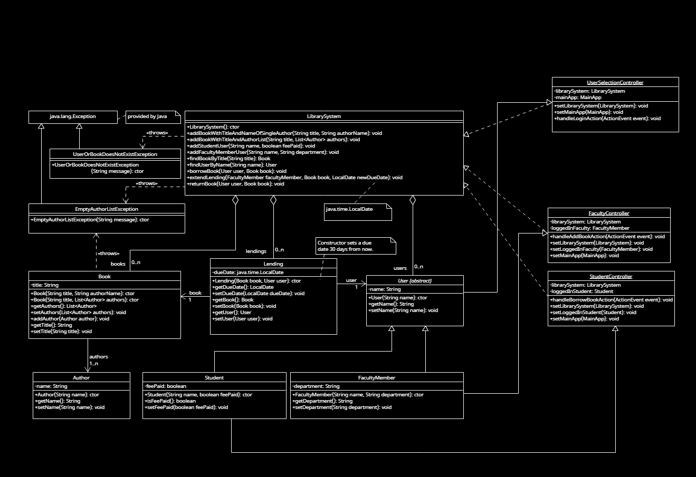

# Library System

Simple Library System that lets you log in as faculty or student, and lets you add books as faculty and lend books as a student.

## Running the program

When you are ready to run the program, first run mvn clean package which will generate a fat jar and a shader file of the fat jar.
Attached you have bat file called run that you can execute to run shader jar which will run the program.

First you should login as a Faculty user and add a couple of books, then you can click back and login as a student to borrow a book.

## Design Diagram

## Built With

* [Maven](https://maven.apache.org/) - Dependency Management

## Authors

Arnar Eyðunsson Simonsen

## License

This project is licensed under the MIT License - see the [LICENSE.md](LICENSE.md) file for details

